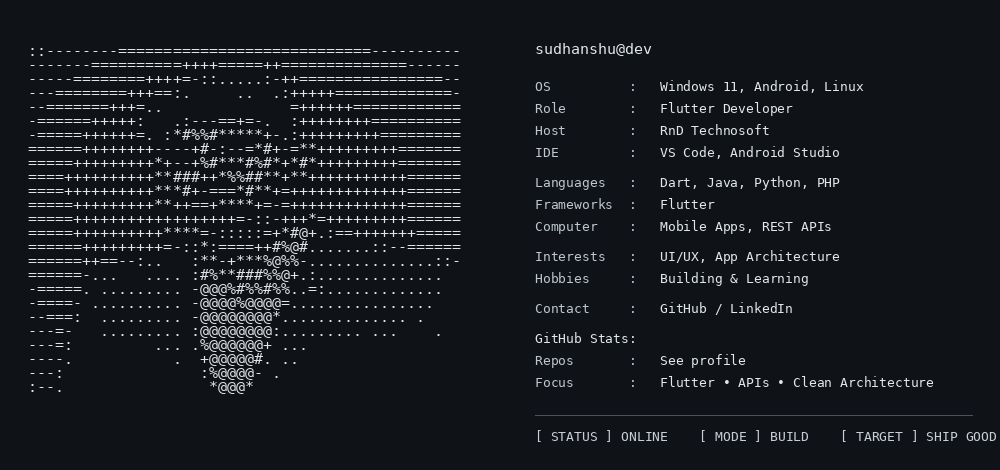

# Sudhanshu Singh

<p align="center">
  
</p>

## `> whoami`

**Sudhanshu Singh** — Flutter Developer focused on production-ready mobile applications, polished UI, REST API integration and scalable architecture.

## `> tech_stack`

`Flutter` `Dart` `Provider` `Riverpod` `REST APIs` `Firebase` `MySQL` `SQLite` `Git` `GitHub`

## `> current_focus`

```text
[+] Flutter application development
[+] REST API integration
[+] State management
[+] Clean / feature-first architecture
[+] Production UI & UX
[+] Git / GitHub workflows
```

## `> connect`

[GitHub](https://github.com/sudhanshusinghrndtechnosoft)

---

```text
[ STATUS ] ONLINE
[ MODE   ] BUILD
[ TARGET ] SHIP GOOD SOFTWARE
```
