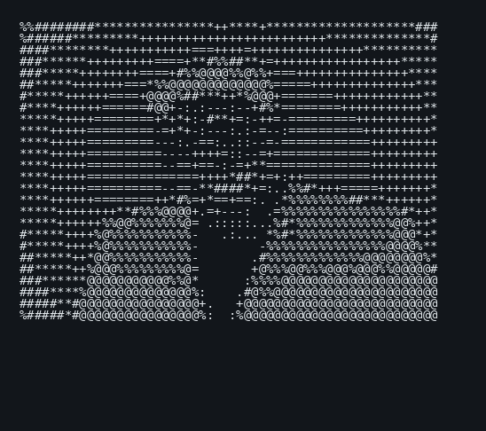

# `sudhanshusinghrndtechnosoft`

```text
┌──────────────────────────────────────────────────────────────────────────────┐
│  sudhanshusinghrndtechnosoft                         FLUTTER DEVELOPER        │
│                                                                              │
│  ┌──────────────────────┐    OS          : Windows 11 / macOS               │
│  │                      │    Role        : Flutter Developer                 │
│  │    ASCII PORTRAIT    │    Stack       : Flutter, Dart, REST APIs          │
│  │      SD / PHOTO      │    State Mgmt  : Provider, Riverpod                │
│  │                      │    Database    : MySQL, SQLite, Firebase            │
│  └──────────────────────┘    IDE         : VS Code, Android Studio           │
│                                                                              │
│                              Languages                                       │
│                              Flutter / Dart / Java / Python / PHP             │
│                                                                              │
│                              GitHub                                          │
│                              Building apps • APIs • UI • Backend integration  │
└──────────────────────────────────────────────────────────────────────────────┘
```

<p align="center">
  
</p>

## `> whoami`

**Sudhanshu Singh** — Flutter Developer focused on building clean, production-ready mobile applications, polished UI, REST API integrations and scalable app architecture.

## `> tech_stack`

| Mobile | Backend & Data | Tools |
|---|---|---|
| Flutter | REST APIs | Git |
| Dart | MySQL | GitHub |
| Android / iOS | SQLite | VS Code |
| Provider / Riverpod | Firebase | Android Studio |

## `> current_focus`

```text
[+] Flutter application development
[+] REST API integration
[+] State management
[+] Clean / feature-first architecture
[+] Production UI & UX
[+] Git / GitHub workflows
```

## `> github_stats`

<p align="center">
  
  
</p>

## `> connect`

<p align="center">
  <a href="https://github.com/sudhanshusinghrndtechnosoft">GitHub</a>
</p>

---

```text
[ STATUS ] ONLINE
[ MODE   ] BUILD
[ TARGET ] SHIP GOOD SOFTWARE
```
